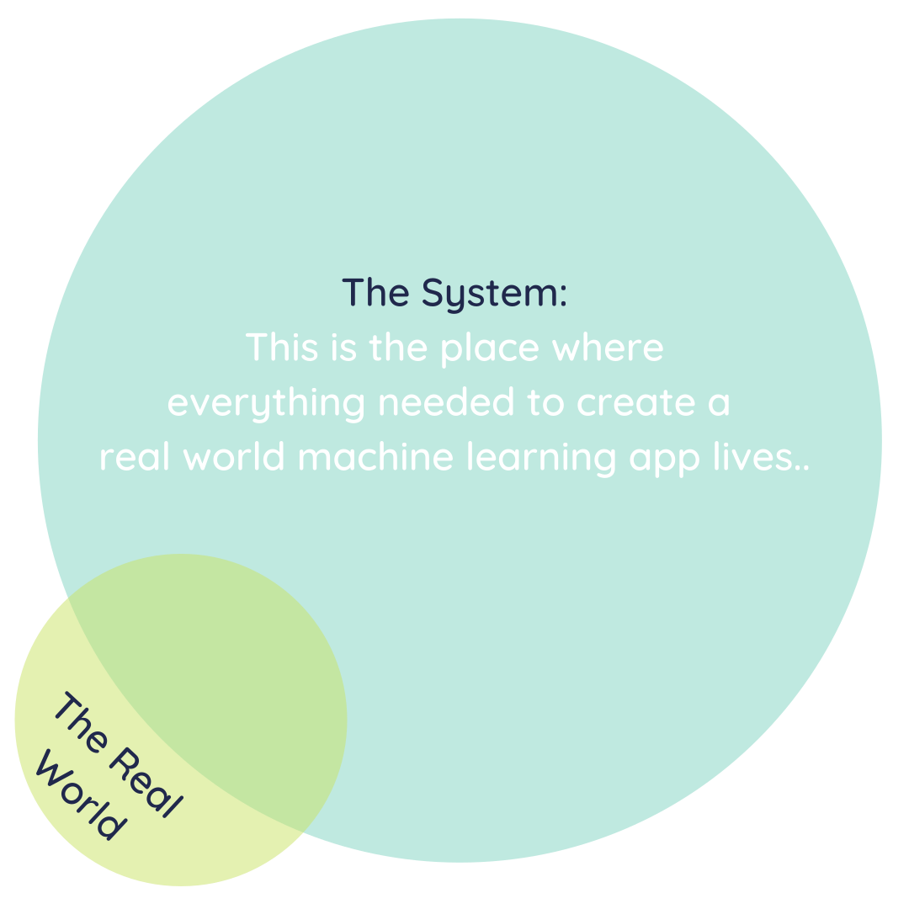

# Real world machine learning

Real world data (aka data in the wild) tends to be messy, unstructured and sporadically captured. As such, it is not enough to know
about computer vision, natural language processing, data storytelling and data pipelining concepts, we need to actually apply
them.

Having static data pipelining, computer vision and natural language processing is enough to build a sophisticated robot. However, this robot will need tons
upon tons of data to be cleaned and organized by humans before it even comes to be. However, because of the nature of real world data,
the output of our robot will still need to be corrected by humans, even as its mechanical parts are serviced by humans.

To complement the two applied areas of machine learning, we need data storytelling and dynamic data pipelining. Deploying machine learning models into the
world can be incredibly complex, but nothing beats trying to

* identify concept and model drift
* systematically analyze error and optimize models
* explain how everything works to key stakeholders to build trust
* add new data sources into the data pipeline and removing 'stale' data
* teach new people how to use the application housing the model

AT THE SAME TIME.

This can get very complicated, as shown in the visual below:

So let's break it down.

## The Break Down

### The environment

Impactful machine learning has to incorporate both real world perspectives and technical expertise. It can be visualized as shown below:

Naturally, there is a need to bridge the gap between

* people in the real world using the product (with no idea of what's going on under the hood) and
* technical people involved in the construction and maintenance of the machine learning system

This is where **data storytelling** comes in.

### Data storytelling

By using teaching techniques, stylistic devices (e.g. narrative, humour etc.) and great design (especially for data visualizations), data storytellers are able to help non-technical users identify

* how the app would fit into their day-to-day,
* what restrictions they need to protect their privacy and
* what improvements they would need for the machine learning app to be used more intuitively

Once user requirements are obtained, data storytellers translate them into technical requirements, so that the user controls the machine learning app, not the other way round.

This is visualized below:

Data storytellers can include infographic creators, data scientists, data analysts, statisticians and BI (Business Intelligence) developers.

A question then arises, how exactly will these requirements be implemented?

This is where **data pipelining** comes in.

### Data pipelining

