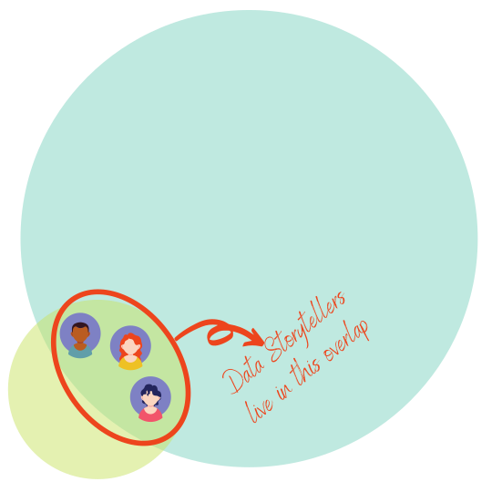
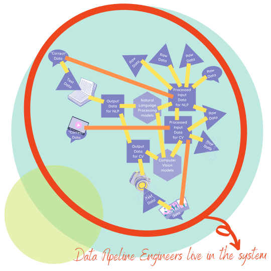
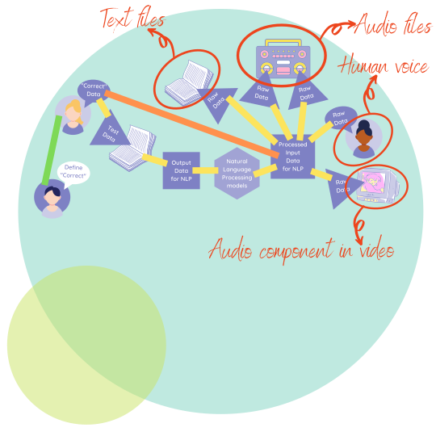

# Real world machine learning

Real world data (aka data in the wild) tends to be messy, unstructured and sporadically captured. As such, it is not enough to know
about computer vision, natural language processing, data storytelling and data pipelining concepts, we need to actually apply
them.

Having static data pipelining, computer vision and natural language processing is enough to build a sophisticated robot. However, this robot will need tons
upon tons of data to be cleaned and organized by humans before it even comes to be. However, because of the nature of real world data,
the output of our robot will still need to be corrected by humans, even as its mechanical parts are serviced by humans.

To complement the two applied areas of machine learning, we need data storytelling and dynamic data pipelining. Deploying machine learning models into the
world can be incredibly complex, but nothing beats trying to

* identify concept and model drift
* systematically analyze error and optimize models
* explain how everything works to key stakeholders to build trust
* add new data sources into the data pipeline and removing 'stale' data
* teach new people how to use the application housing the model

AT THE SAME TIME.

This can get very complicated, as shown in the visual below:

So let's break it down.

## The Break Down

### The environment

Impactful machine learning has to incorporate both real world perspectives and technical expertise. It can be visualized as shown below:

Naturally, there is a need to bridge the gap between

* people in the real world using the product (with no idea of what's going on under the hood) and
* technical people involved in the construction and maintenance of the machine learning system

This is where **data storytelling** comes in.

### Data storytelling

By using teaching techniques, stylistic devices (e.g. narrative, humour etc.) and great design (especially for data visualizations), data storytellers are able to help non-technical users identify

* how the app would fit into their day-to-day,
* what restrictions they need to protect their privacy and
* what improvements they would need for the machine learning app to be used more intuitively

Once user requirements are obtained, data storytellers translate them into technical requirements, so that the user controls the machine learning app, not the other way round.

This is visualized below:

Data storytellers can include infographic creators, data scientists, data analysts, statisticians and BI (Business Intelligence) developers.

A question then arises: *How exactly will these requirements be implemented?*

This is where **data pipelining** comes in.

### Data pipelining

To get valid results that can be valid stories, we need to make sure that the data on which the modelling is based is *clean*: that is:

* approved by a domain expert
* statistically validated
* tracked as it undergoes transformation
* organized as much as possible, once it enters the system
* having complete metadata (data explaining characteristics of the data)

As they say: *garbage in, garbage out*. If the data is fed directly into the models in a haphazard manner; troubleshooting what went wrong or trying to explain
the output given by the ML app becomes a nightmare. Enter data pipelines - A smooth way to

* ensure <u>data lineage</u> (having different _**labeled**_ versions of the data as its being transformed, with the labels describing the various transformations in detail)
* ensure <u>data provenance</u> (having metadata that explains the context around data collection, the characteristics of the various data sources and a high level explanation of the data transformation)
* establish best practices to clean and standardize data
* strengthen data security (due to the tracking) and quickly detect any data breaches if they were to occur

This is illustrated by the pipes in the image below:

Data pipeliners typically include IT, backend developers, machine learning engineers, data scientists and database administrators.

Now that the data infrastructure is in place, now we can enter into **machine learning** territory.

### Machine Learning

Machine learning comprises of two types of teams:
* Technical teams
* Non-technical teams

The technical team would comprise
* the data administrators and pipeline builders,
* the data preprocessors,
* the ML algorithm design specialists and
* the model implementers and evaluators

The non-technical team would comprise
* the subject matter experts (they define what "correct" is)
* the data entry workers
* the checkers (those that make sure appropriate labels are applied correctly)

Both teams are integrated into the system - therefore, this system is commonly referred to as a **Human in the Loop** kind of machine learning system.

Advantages of this method is that:
* There is optimal specialization and division of labour
* If the non-technical and technical team have frequent contact and all individuals collaborate, they can advise each other on things like
    * improvement of data labelling and preprocessing processes
    * error analysis

Disadvantages of this method is that:
* The cost of model development can increase, especially if the number of data entry and checking workers keeps growing with the available data.
* There tend to be silos when this is implemented in the real world, with no room of growth; for instance, growing from a data checker to a machine learning engineer rarely happens.
* Data entry and checking work tends to be subcontracted to less developed countries, and many subcontractors do not match pay and working conditions to global standards typically implemented in developed countries.

#### <u>Natural Language Processing</u>

Natural Language Processing has the following data sources

Text can be tricky because printed text (PDFs and scans) or text that is handwritten need to be
* converted to photo,
* read using OCR and computer-vision technology,
* converted to string, then
* fed back into the NLP ML system as raw data

Otherwise, text directly input into computer systems and stored in common text formats are pretty easy to feed into an NLP system.

Another key thing to note is that the data can come into the system either as a batch or as a stream; also, it could be pre-recorded or captured on the spot.

All the above affect how the data pipeline for the NLP system will be built, as well as the analysis and modelling procedure required.

