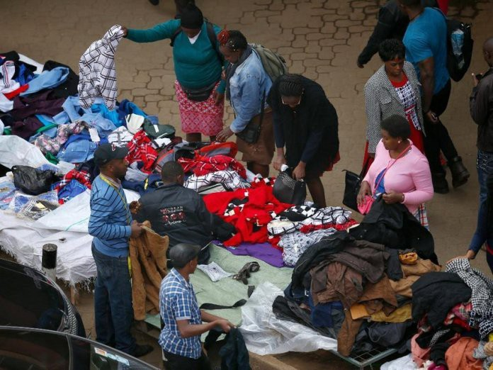

# Economical article 2

## Increasing Demand in an Emerging Economy

**Publisher**: [*DataDrivenInvestor on Medium*](https://medium.datadriveninvestor.com/increasing-demand-in-an-emerging-economy-7bfc89c62606)  
**Publishing Date**: *May 30, 2019*

         
*Hawkers selling their wares within Nairobi's Central Business District (image courtesy of Kenyan Report)*

In 2018, [an economic survey](https://www.knbs.or.ke/economic-survey-2018-launched/) found that the average Kenyan lives on USD78 / Ksh.7800 a month. They feed themselves
with USD42 / Ksh.4,200 a month and spend the rest on non-food items. Even by Kenyan standards, this amount is quite low. Shopping at a supermarket on such a budget for one
person is quite stressful; now consider that such a person is feeding aging parents, children or even (sometimes) a spouse.

How do people survive on so little?

Some people save small amounts and then pool their resources to buy food in bulk and split it among themselves, or buy from retailers who do such activities (in Kenya,
they form what is commonly referred to as the "kadogo" economy because very small transactions are made when exchanging money for goods). Others save small amounts with
their employer which they can cash out and use to pay school fees or other high-cost expenditures.

Some people establish a good rapport with a small retailer in their neighborhood, ask for a soft loan which they use to buy food on credit, refunding the retailer once
their monthly payment comes through.

There are others who receive financial aid during mid-month when things are tight from NGOs, wealthier relatives, neighbors and/or friends; others ask their employer for
a salary advance which is then recovered from their next payslip.

All of the above are Kenyanized versions of 5 very common financial instruments: savings, credit, payments, insurance, and remittances.

To have the conversation on stimulating growth in an emerging economy, we need to also appreciate and understand the economic and financial realities of the average
consumer in that economy.

There is the school of thought commonly known as trickle-down economics that basically argues that when we strengthen and formalize all the dynamics above, prosperity 
is automatic. However, we must remember that money must be earned first to be spent - this is a time-intensive process; also, basic needs must be met first before
investment needs. Finally, it's hard to grow and participate in the global economy when it is a struggle to meet the most basic needs.

For the purposes of this conversation, we shall assume that demand is the ultimate factor of economic growth (even though there are arguments to the contrary) in emerging
economies. If we are ever to grow a $78 income, we have to stimulate and grow demand. It is my hope that someone doing business in an emerging market can find the
suggestions on here of value and use in their day-to-day reality.

****

## What is demand?

An economist would tell you that demand is the [number of goods that people buy at various prices over a particular timeline](https://en.wikipedia.org/wiki/Demand).
From the definition alone, one would be tempted to simplify things and say that pricing and timing influence demand. However, there is a myriad of factors, known and
unknown, that influence demand.

[5 key things](https://www.thebalance.com/five-determinants-of-demand-with-examples-and-formula-3305706) that do influence the demand of an individual consumer include:

1. The price of the good/service
2. The disposable income of the consumer
3. Prices of related goods/services - complements and substitutes
4. Consumer tastes and preferences
5. Consumer speculation on future market prices for the good/service

When we look at emerging markets, the good's/service's price and the consumer's income tend to go hand-in-hand. For many people, their incomes are low which force them
to become price sensitive; this makes most businesses compete to either become cost-leaders and serve the masses, or niche-leaders and serve <20% of the population.

Secondly, when income is low, consumer tastes and preferences play a less pronounced role. Price sensitivity also turns goods and services into commodities - not many
people stop to think about what brand of clothing, peanut butter and headphones they will be buying when their total budget is 3 dollars; they have to stretch that money
and look out for bargains.

A good example of this principle in action is how consumers in Nairobi shop for ladies' shoes. Bata Kenya is one of the largest shoe store chains in the country. Small
shops (commonly known as "exhibition") stock shoes imported from foreign countries such as China and Turkey and individual importers of second-hand items also clean and
sell shoes. In the eyes of a typical lady, those shoes are more or less the same.

Seeing opportunity; there has now emerged a special kind of exhibition shops that only stock flat shoes for Ksh.500/ 5 US dollars. They are quite cheap and low quality
(only lasting a year); however, they serve the purpose (walking on the roughed-up sidewalks of Nairobi) and they look stylish, almost identical to what you would find
at a place like Bata.

So what could businesses do to increase local demand and stay alive?

Firstly, they need to figure out current tastes and preferences in the market by experimenting more often - embracing risk and staying nimble. Before a business fully
invests, why not sell the upcoming product directly to their target market? This will give them the opportunity to implement techniques such as A/B testing and get a
feel of what the optimal price should be - purchasing original research has long lead times and existing research is little and old. This is especially true when the
target market is in rural areas. Plus, if done creatively, it can increase consumer expectations that the price will go up fast, so it would be wise to buy on the spot.
This means that brands in such markets really need to generate feelings of "This is such a great opportunity!" in the customer experiences that they create in the mass
market.

Secondly, businesses should make bundling their friend in an emerging market. When complements are paired with the good/service, the two help repel competition from
substitutes. Businesses could consider entering into more strategic partnerships to combine domain strengths and scale faster. Furthermore, bundling can help in reducing
price sensitivity in the long run.

Thirdly, consider more co-creation opportunities with the consumer. Leverage on existing collectivism, common in most emerging market societies, by offering smaller
quantities of the co-created product, discounts on the original product or even an increase in disposable income to the consumer when they get people in their network
to use or buy the product. This will allow the network effect to work for you both offline and online. Create a symbiotic relationship with your consumer.

Finally, focus on growing investment income drawn from a global portfolio to enable the business to have patient money and mitigate risk. If the business cannot open
across a swathe of countries (investing its own equity in the countries), consider investing in the debt markets of those countries. This additional income can help
fund more R&D and help the business when it's going through an internal rough patch, a low season or even a dip in the business cycle.

When we adopt a learner's mindset to the market, we get to adapt and maintain control, allowing us to grow and scale more businesses in emerging markets.
