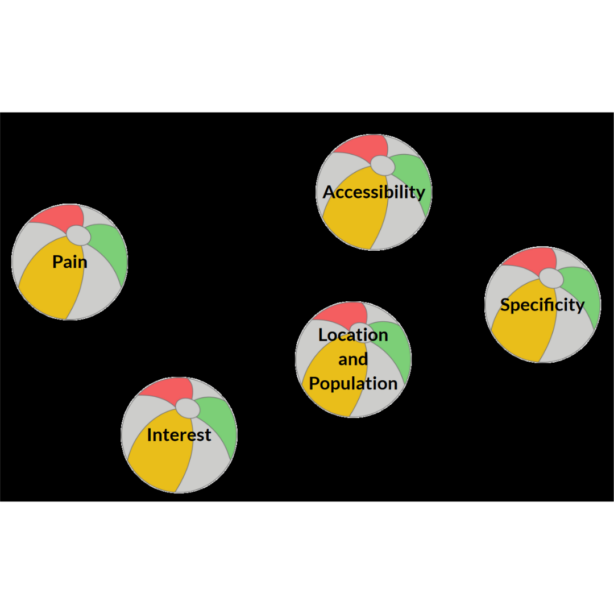
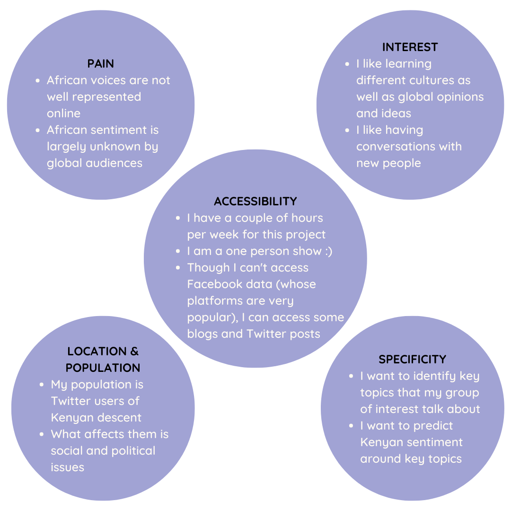
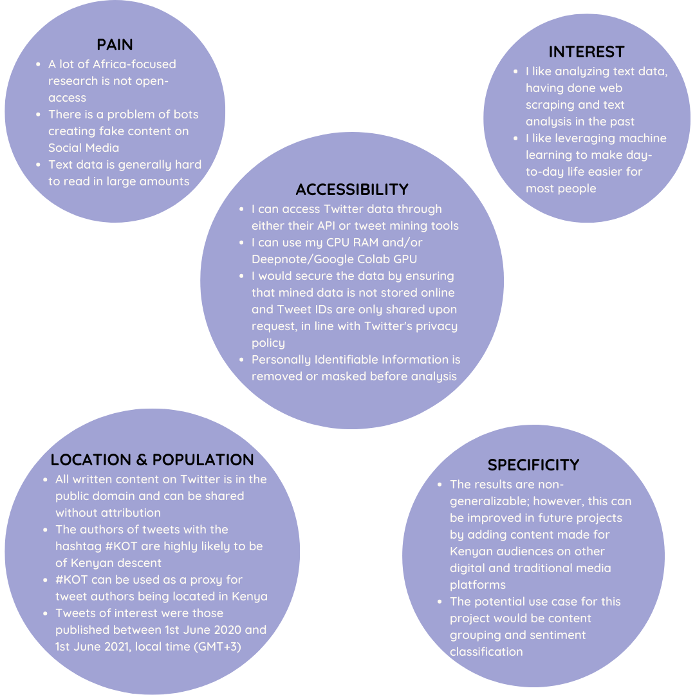
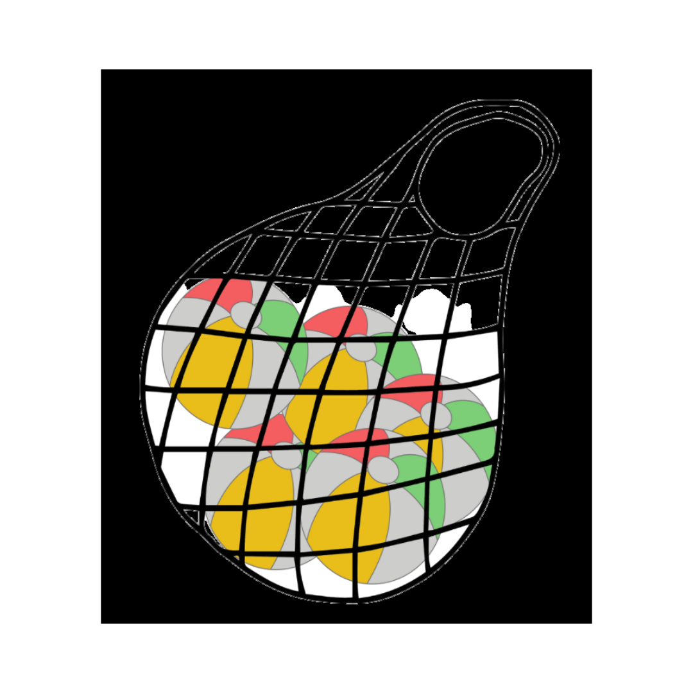

# ML/Data Science article 3

## Delivering Success in Natural Language Processing Projects: Part Two

**Publisher**: [*Medium*](https://medium.com/@ceethinwa/delivering-success-in-natural-language-processing-projects-part-two-897e616bc8e2)  
**Publishing Date**: *Aug 3, 2022*

  
*The metaphorical toolbox in all its glory...*

*This is the second post of a five-part series where I aim to demystify Natural Language Processing (NLP) through a key 
learning tool that I would call* **the NLP toolbox**. *You can access the previous article
[here](https://medium.com/@ceethinwa/delivering-success-in-natural-language-processing-projects-part-one-40c4775cf6a9).*

A quick recap:

* Though algorithms are increasingly controlling our day-to-day, only a few people can create and/or understand them.
* Mental scaffolding is useful to help more people understand algorithms and manage technical projects.
* The NLP toolbox can help us manage NLP projects and map out NLP concepts that we need to understand in order to fairly assess these projects.
* The NLP toolbox is **a collection of concepts, tools and ideas available for building applications that can handle real-world challenges around understanding content from all over the world**.

[The scientific research method](https://uedufy.com/the-scientific-method-definition-steps-role-in-research/) is a classic
go-to for structuring any research project, while the [CRISPR-DM](https://www.datasciencecentral.com/crisp-dm-a-standard-methodology-to-ensure-a-good-outcome/)
framework helps data scientists bring their projects to life. The NLP toolbox is meant to help strike the delicate balance between

* taking the time to deeply study a phenomenon and
* rapidly skim through relevant work

in order to apply scientific findings to the fast-paced world of business, adapted to rapidly changing consumer needs and wants.

There are therefore 4 stages in the research process where we can apply the NLP toolbox:

1. Problem Definition
2. Data Exploration
3. Feature Engineering
4. Model Fitting and Evaluation

****

### Problem Definition

Imagine dealing with a whole bunch of bouncy beach balls like these ones that have to be put in a net for storage:

 
*All the bouncy beach balls that you have to catch.*

That’s how it can feel sometimes identifying a problem that can be solved through NLP. We have to consider these 5 elements and combine them well:

1. Pain
2. Accessibility
3. Specificity
4. Interest
5. Location and Population

#### Round 1 of Questions

To start off, reflect on the questions under each element below and write down your initial and/or gut responses;

**Pain**

> What annoys you in your day-to-day life (e.g. at work, home, school or leisure)?
> 
> What do you think is humanity’s biggest source of pain?

**Interest**

> What do you like reading or listening to?
> 
> What are you curious about?

**Accessibility**

> What time constraints do you have?
> 
> How many people can you team up with to do a work/home/school/leisure project?
> 
> What resources (articles, newsletters, audio, video, ebooks) to you have access to that are crowding your computer or inbox?

**Location and Population**

> What group of people, plants, animals or things do you enjoy learning about and discussing?
> 
> Where is this kind of group located?
> 
> What affects this group the most?

**Specificity**

> What small area out of your answers from the other 4 elements would you like to concentrate on?
> 
> Would it be worth the cost and effort finding a solution to the area of your study?
> 
> How much scope within your problem area would you like to cover?

Once you are done with these questions and you have some answers outlining a real-world problem, check if your project
idea (the collection of your answers) could have solid answers to the following round of questions:

#### Round 2 of Questions

**Pain**

> Is the data source for your project idea consisting of complex data types (i.e. waveforms, images, text)?
> 
> Is your data stored in an unstructured manner, hard to summarize with traditional summary statistics (number of groups, mean, mode, median etc.)
> 
> Is your data too big to read? Watch? Listen to?

**Interest**

> Do you enjoy consuming loads of content both on and off the Internet?
> 
> Do you enjoy listening to differing ideologies, philosophies and opinions in particular areas (e.g. sports, politics, religion etc.)

**Accessibility**

> Do you have legal permission and subject consent to access the data that you are interested in collecting?
> 
> Do you have enough computational resources to handle the data needed to bring your project idea to life?
> 
> Is your data anonymized to protect subject privacy and minimize researcher bias?

**Location and Population**

> Do you have creator(s) consent for fair use?
> 
> Where is the creator(s) located (e.g. they are located in a jurisdiction where there is strict data protection)?
> 
> What group(s) does the data subject belong to and is it connected to the group(s) that you would wish to study?

**Specificity**

> Are you seeking generalized results to the real world (if so, NLP may not be for you — we are still far away from zero-shot machine learning)?
> 
> What use cases do you have in mind where your project idea would apply?

By the end of round two, you should have something resembling a rough summary of your project idea.

#### How would the Problem Solving process apply to a real-life example?

I had just started my [Delta Analytics fellowship](http://www.deltanalytics.org/global-teaching-fellows.html) and I needed
to quickly come up with a compelling project idea.

Mapping everything onto the real world resulted in these Round 1 answers:

 
*Real world answers*

and these Round 2 answers:

 
*NLP specific answers*

The result?

I did background research on [social media trends in Kenya](http://www.usiu.ac.ke/assets/file/b8243945-usiu-africa-kenya-social-media-lansc.pdf)
and defined Kenyans on Twitter as follows:

> **Kenyans on Twitter** is a decentralized group of Kenyans that use the hashtag **#KOT** to **organize** and **mobilize**
> around **political** and **socio-cultural** issues both within Kenya and outside her borders.

The abstract that I submitted for my project:

> Kenya is a linguistically diverse country with over 40+ languages, but current NLP solutions serving her inhabitants
> do not capture this linguistic diversity. Furthermore, many Kenyans code-switch, particularly in informal settings and
> this requires a fresh approach to conducting NLP tasks on data generated by Kenyans.
> 
> The aim of this project is therefore to build a Natural Language Processing Solution for multilingual, code-switching
> cultures, using sentiment analysis on Kenyan social media as a use case. The data used was all tweets containing #KOT
> written during 1st June 2020–1st June 2021; #KOT is a hashtag that Kenyans on Twitter typically use to identify
> themselves. A problem-solving and project management framework, the NLP toolbox, was used to come up with this solution.

The first paragraph described *real-world* attributes of the problem, while the second paragraph described *technical*
attributes of the problem.

Problem in the bag!

****

Join me on the [next article](https://medium.com/@ceethinwa/delivering-success-in-natural-language-processing-projects-part-three-79e6e604ddf9) where we dig into our metaphorical toolbox once more.
