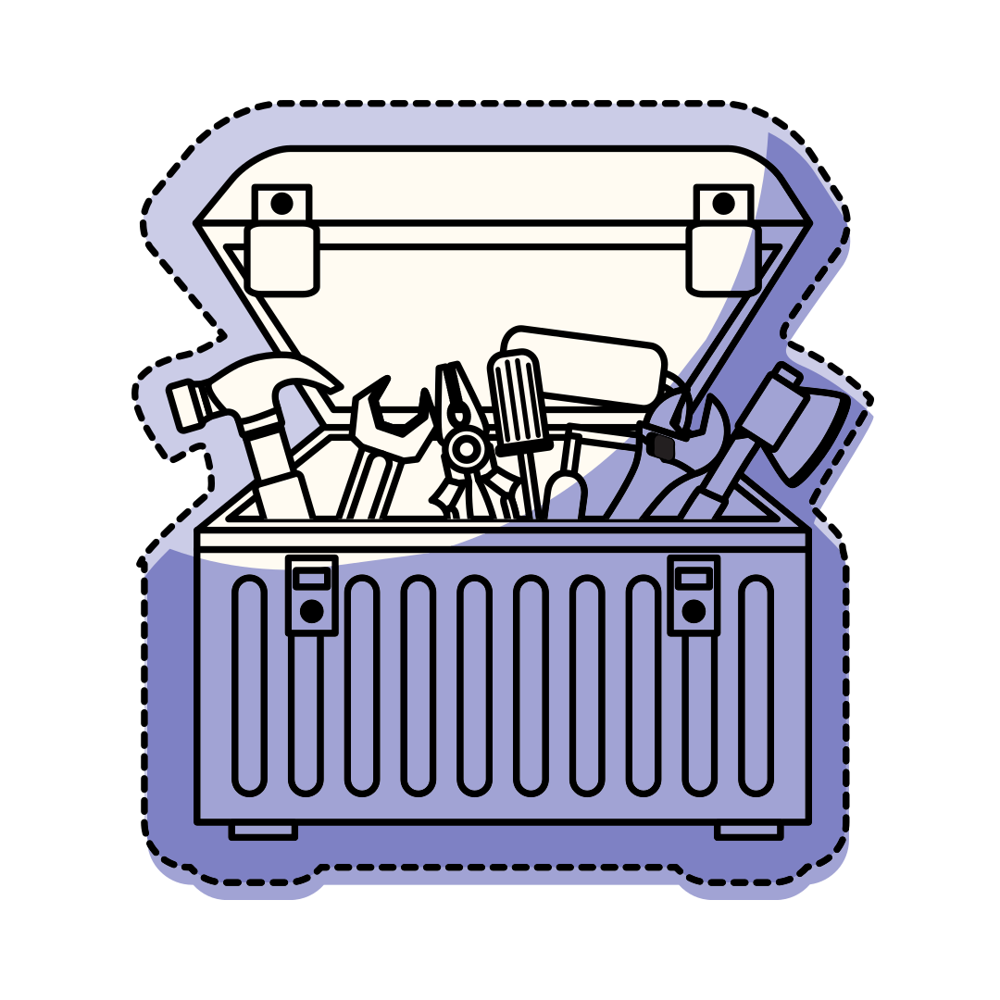

# ML/Data Science article 3

## Delivering Success in Natural Language Processing Projects: Part Two

**Publisher**: [*Medium*](https://medium.com/@ceethinwa/delivering-success-in-natural-language-processing-projects-part-two-897e616bc8e2)  
**Publishing Date**: *Aug 3, 2022*

  
*The metaphorical toolbox in all its glory...*

*This is the second post of a four-part series where I aim to demystify Natural Language Processing (NLP) through a key 
learning tool that I would call* **the NLP toolbox**. *You can access the first article
[here](https://medium.com/@ceethinwa/delivering-success-in-natural-language-processing-projects-part-one-40c4775cf6a9).*

