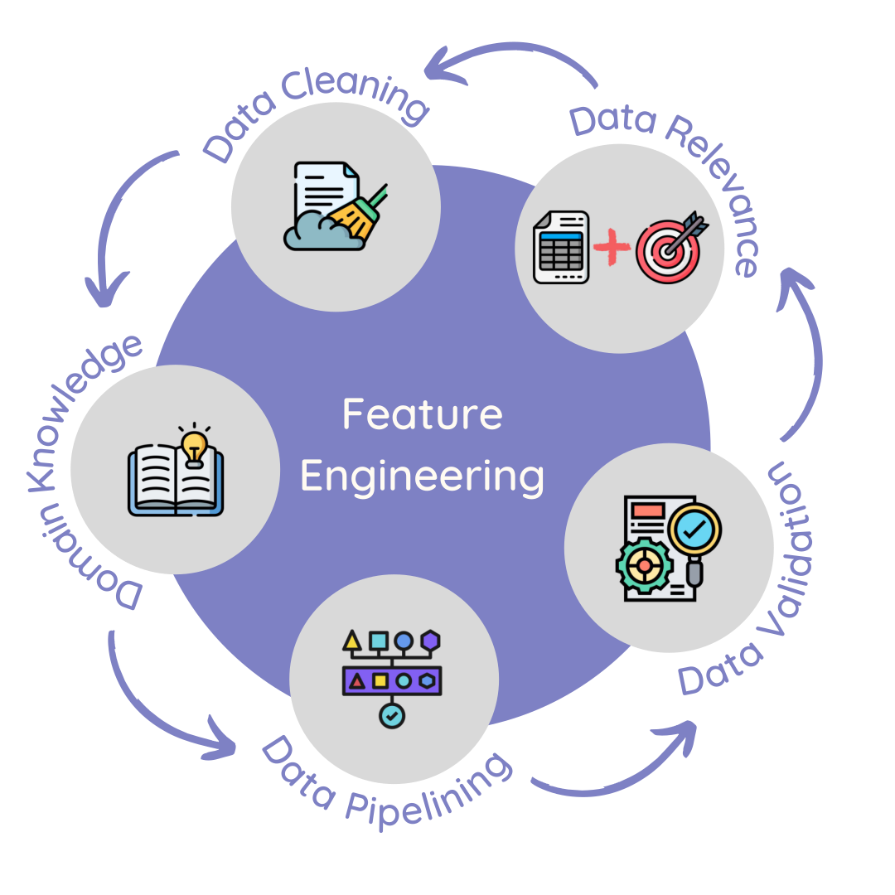

# ML/Data Science article 5

## Delivering Success in Natural Language Processing Projects: Part Four

**Publisher**: [*Medium*](https://medium.com/@ceethinwa/delivering-success-in-natural-language-processing-projects-part-four-405e8d5a407a)  
**Publishing Date**: *Sep 12, 2022*

*This is the fourth post of a five-part series where I aim to demystify Natural Language Processing (NLP) through a key learning tool that I would call the **NLP toolbox**. You can access the previous article [here](https://medium.com/@ceethinwa/delivering-success-in-natural-language-processing-projects-part-three-79e6e604ddf9).*

What a ride! We got to explore both types of NLP data and visualize them in the previous section. Before we move any further, based on the last three parts, it’s clear to see that:

1. **Problem Identification** is a *process* of recognizing *valuable* problems that are *hard* for most people but *easy* to solve when *technology* and *creativity* are combined.
2. **Data Exploration** is a *process* of *analyzing* the data to find *patterns* within it and *summarize* key characteristics of the data.

----

### Feature Engineering

> So, what is Feature Engineering?

**Feature Engineering** is a *process* of *transforming* the data to make it *easier* for the computer to "understand" and produce *relevant* results during modelling.

It consists of various elements as shown:

  
*Feature Engineering visualized.*

Feature Engineering in NLP, as you can imagine, tends to be very difficult to understand and apply because

* data cleaning,
* domain knowledge,
* data pipelining,
* data validation and
* data relevance

are also broad. Furthermore, it is a repeated process because both

1. Concept drift — when the project goals change for the particular NLP project, and
2. Data drift — when the distribution of categories in NLP data changes

happen.

[Learn more about concept and data drift [here](https://medium.com/mlearning-ai/concept-drift-data-drift-and-machine-learning-monitoring-how-to-keep-your-model-accurate-66f3c91c7888).]

Due to the fact that feature engineering is cyclical, it should ideally be in the form of a data pipeline of some sort that is monitored, with model outputs identifying areas of improvement for the pipeline over time.

Depending on your NLP task and data type, feature engineering greatly varies.

 

#### **Data Cleaning**

##### **Data Cleaning for Audio**

As highlighted earlier, feature engineering audio typically tends to involve the data encoded in the form of spectrograms, ready for modelling.

Remember the visualizations below?

  

These were spectrograms of [this audio](https://ceethinwa.github.io/resources/aud/Abstract.mp3). Based on the visualization, we get an important insight: The sound was mixed to be identical for both left and right channels. Assuming there are a couple of audio files, spectrograms for only the left channel could be selected for modelling and feature engineering would be complete.

> However, using only spectrograms would create hidden features, making resulting models **uninterpretable** and **unexplainable**.

An alternative to spectrograms is to transcribe the audio, converting it to text data. Each audio would be represented as text transcripts as well, split by particular timestamps. At the moment, transcripts in English can be easily generated, with humans speaking the language reviewing the file to ensure accuracy and meaning are kept. However, for many low-resource languages, accessing audio — let alone transcribed audio — is difficult.

It is recommended to have more than one form of encoded audio data e.g. representing the same data as both a metadata table and spectrogram, which can each have an ID label linking the two.

[*Librosa*](https://pypi.org/project/librosa/) is a popular Python package used to identify spectral and rhythm features from any audio represented.

##### **Data Cleaning for Text**

Cleaning text data involves encoding it and removing unnecessary symbols — exactly what was done during data exploration. Text data can be encoded in two ways:

* Manually and
* Programmatically.

If encoded manually, it can be encoded in such a way that key words or phrases are kept i.e. one-hot encoding. Findings from data exploration and available domain knowledge would inform feature selection. This would typical result in direct feature extraction (if original dataset was text) or a metadata table (if original dataset was audio).

A benefit of manual encoding is that it gives human oversight to model input and it facilitates interpretability. However, the data annotation process can be quite tedious, and it tends to be poorly-paid work, relative to other aspects of feature engineering, such as feature selection and pipeline building.

Programmatic encoding can be very helpful in identifying hidden features that a human being may not have typically thought of, and it involves use of unsupervised machine learning models. However, we run into the same problem of model interpretability.

Programmatic encoding models include:

* *TF-IDF* (Term frequency-inverse document frequency) model — learn more about it [here](https://www.geeksforgeeks.org/tf-idf-model-for-page-ranking/)
* *PV-DM* (Distributed Memory Model of Paragraph Vectors) model — learn more about it [here](https://cs.stanford.edu/~quocle/paragraph_vector.pdf); it is implemented in a Python package, [Gensim](https://pypi.org/project/gensim/)
* *PV-DBOW* (Distributed Bag of Words model of Paragraph Vectors) model — learn more about it in the same article describing PV-DM; it is also implemented in Gensim
* *LDA* (Latent Dirichlet Allocation) model — learn more about it [here](https://www.geeksforgeeks.org/latent-dirichlet-allocation/); it is implemented in a Python package, [pyLDAvis](https://pypi.org/project/pyLDAvis/)
* Use of *Transformers* (pre-trained and validated deep learning models) such as BERT; learn more about transformers in general [here](https://medium.com/inside-machine-learning/what-is-a-transformer-d07dd1fbec04)

Further data examining similarity between specific vectors can be used to evaluate the effectiveness of this type of unsupervised encoding as shown [here](https://medium.com/analytics-vidhya/best-nlp-algorithms-to-get-document-similarity-a5559244b23b) and [here](https://gab41.lab41.org/doc2vec-to-assess-semantic-similarity-in-source-code-667acb3e62d7).

 

#### **Domain Knowledge**

Before you feed hidden and opaque features into your model of choice, it is best to collect domain knowledge in the problem space that you are operating in. There are two kinds of domain knowledge needed to adequately perform feature engineering:

* **Technical domain knowledge**: This involves machine learning research done by computer scientists and general information available on the internet from data professionals on what ML techniques are best for audio files of different types. [This article](https://towardsdatascience.com/visualizing-audio-data-and-performing-feature-extraction-e1a489046000) seeks to demonstrate how to extract features relevant for music classification while [this article](https://www.microsoft.com/en-us/research/wp-content/uploads/2016/02/FeatureEngineeringInCD-DNN-ASRU2011-pub.pdf) compares different feature engineering methods used in transcription.
* **Contextual domain knowledge**: This involves getting specific peculiarities of the culture the music and/or language is in, such as different accents, culturally-specific vocabulary, or typical instrumental arrangements (for music audios). This is typically provided by a Subject Matter Expert (SWE)— this could be a person who lives/works in the context that the audio was generated in (e.g. a doctor being a SWE for a hospital’s emergency response calls) or an academic studying the audio generated (e.g. a linguistics professor specialized in West African languages being a SWE for Ghanaian and Nigerian pidgin news audio). In the absence of a SWE, resources generated from and about the culture under study could give context.

>> One thing is clear — we need to have more than one type of encoded data, be it audio or text; the data has be be represented in manually encoded and programmatically encoded forms to account for both forms of domain knowledge.

 

#### **Data Pipelining**

Data pipelining involves all the activities that ensure data from multiple, relevant sources is ingested, cleaned and transformed in a systematic way. A good data pipeline consists of:

* **Documentation** of data sources, steps in data transformation and how various dataflows are orchestrated; this is helpful when down the road, the data pipeline needs to be maintained and the data engineer needs to understand the context of a particular transformation step. This can be as simple as keeping an Excel file or Jupyter notebook, or as complex as automated alerts operating in serverless environments.
* **Version control** of the code that makes up the pipeline itself, documentation and data storage; this keeps various copies of the data at each transformation step separated from each other (allowing for rollback to earlier versions), tracks changes to data input and output, and it prevents raw data from being converted into features by accident. It can be as simple as having 2 folders: raw and transformed connected by code and notes in a Jupyter notebook — or as complex as a series of event alerts from a PubSub service in a cloud environment, with backup done via git integration.
* **Scalable data storage** helps avoid the problems that come with underutilized or minimal storage and also accounts for rapid growth of data over time. Currently, the most scalable place for data storage is in a cloud environment, where you only pay for the server space that you use, and technologies have evolved from rigid SQL, to more flexible noSQL databases, to object stores (that can store complex data like images, audio and video), to data warehouses that contain a mix of the aforementioned technologies. As this is relatively new, it can be prohibitively expensive for an individual — hence most devices currently (computers, smartphones, watches) rely on relatively static storage.
* **Simplified, yet flexible data flows** — as data grows and the pipelines under maintenance increase, it is important to have a pipeline that can be adjusted based on the situation at hand. Many tech giants who rely on sophisticated data storage and data flow solutions, are under increased data regulation, even as their data increases exponentially — this has forced them to make sure that their data pipelines can be accessed by people with the relevant credentials for purposes of satisfying IT auditors and government regulators. Balancing simplicity with flexibility can be incredibly difficult, but both are indispensable.

Data pipelines can vary widely, depending on the task at hand, but if we can follow these 4 principles, it becomes easier to build NLP solutions that are solid, even as the data and environment change.

 

#### **Data Validation**

Data validation is incredibly important, as this is where data is checked for any consistencies over time, throughout the pipeline. If raw data is not validated and it heads straight into the modelling stage, wrong machine learning features can lead to spurious or dubious results. There are a number of statistical inference tools that can be used for quantitative data; however, NLP data is mostly qualitative in nature. This can makes it difficult to apply statistical inference techniques.

Data validation takes into account:

* The problem statement
* Discoveries made during data exploration
* Both forms of domain knowledge
* Characteristics of transcribed audio/text in light of linguistic principles like social linguistics, diacritics, morphology, phonology, dialects etc.

The above result in a set of assumptions about the data that need to be tested.

Human review tends to be one of the best (though expensive) ways of testing data assumptions, through a person physically examining either a convenience sample or a random sample. Exploratory data analysis findings of the whole dataset can also yield some useful insights on whether assumptions are valid or not.

Data validation needs to be an ongoing concern, because it ensures that the data being encoded does not have logical errors and all variables have appropriate data types (e.g. numbers are stored as `integer` or `float` data types, not `string` (text) data type).

 

#### **Data Relevance**

This involves circling back to project goals and objectives, relevant stakeholders and past work both from industry and academia to connect theory and actual reality.

To establish relevance, the project plan (be it highly summarized or using project management best principles) should be clear on three key aspects:

* Project goals and objectives
* The generalizable results from the project
* The use cases of the resulting NLP solution

It is against these 3 criteria that we measure selected features and data against.

 

#### **How does feature engineering look like in a real-world project?**

Before beginning feature engineering for my [Delta Analytics teaching fellowship](http://www.deltanalytics.org/global-teaching-fellows.html) project, I considered and checked for both concept and model drift in the corpus under study — in this case, it was a collection of tweets.

Initially I wanted to focus on Kiswahili and/ Sheng words in tweets to determine sentiment; however, when I saw

* there were fewer Kiswahili and Sheng words than expected
* there were other people writing about Kenyan issues in languages other than those (yet tagged by Twitter as "English" tweets),

I had to make my NLP solution more language agnostic and also control for those few non-English words that do indicate sentiment appearing all over the place. Thus **concept drift** took place.

In the same NLP project, the tweets were harvested for a time period of 1 year. As people age, their opinions and sentiment about a particular issue may vary, leading to changes in the proportion of positive and negative sentiment. Furthermore, many slangs (such as Sheng) also vary over time — Sheng words *mamanzi* (used in 2001) and *mayens* (used in 2019) mean the same thing: ladies. Fortunately, as my data was only for a year, I could say that I was relatively safe from **data drift** at the time — however, I had to control for it when creating my NLP solution by ensuring that vectorization occurred anytime the corpus changed.

My project considered all the discussed aspects of feature engineering as follows:

**Data Cleaning**

> I represented the text data
>
> * in a table (containing meta-data based on one-hot encoded key words indicating sentiment in English, Kiswahili and Sheng) and also
> * as a matrix of vectors produced by the PV-DM model.

**Domain Knowledge**

> I relied a lot more on contextual domain knowledge than technical knowledge; it helped that I was from the community under study (Kenya) and I also understood basic NLP technical knowledge.
>
> Because my corpus was multilingual, it meant that my solution had to be language and time agnostic. I only selected the tweets tagged 'en', even though I knew and saw in my sample that they contained more than one language and used short forms.

**Data Pipelining**

> The pipeline I was building was for demonstration purposes — my solution was not in production. Due to time constraints, I chose to run everything locally and have my data pipelining be as simple as possible, even if it was at the expense of flexibility.
>
> I used [Tweepy](https://www.tweepy.org/) to get a snapshot of #KOT tweets; as a result, I did only one round of batch processing; this approach is unfortunately not scalable if other data sources or languages were used.
>
> My documentation and pipeline code was in one place — a Jupyter notebook. There were 2 programming languages in use: R and Python, this gave me visualization and data exploration flexibility.

**Data Validation**

> * An assumption of the dataset based on literature review assumed that the dataset would be political in nature. Of the top 10 mentioned personas (In Twitter they have the @ handle), 3 were government agencies and 2 were prospective presidential candidates; therefore, this assumption is true.
>
> * An assumption of this project was that Kenyans are multilingual, hence there would be a lot of code-switching. To some extent, this is true, as some tweets tagged by Twitter as being English turned out to have Kinyarwanda (indicating #KOT is used also by Rwandese) and some tweets did have more than one language.
>
> * Another assumption of the dataset was that Twitter is used by Kenyans to engage in political debate, hence it was expected that users would have generated many tweets. However, it was found that most users tweeted only once, even as they partook in different conversations; for the most part, most tweets in a particular day were only 100 or below.
>
> * An assumption was that there would be a lot of sentiment within the tweets under study. After manual feature engineering, only 4,038 out of 27,504 (the tweets tagged as English) had any sentiment — it was 97.03% positive. There were also fewer Kiswahili words that indicated sentiment, compared to English ones. This indicates that the dataset was highly imbalanced both from a language and sentiment point of view.

**Data Relevance**

> The generalizable results expected from this project were: **a systematic way of handling code switching for application in other cultures and languages**.
>
> The project goals for this project were
> 1. **manage any code-switching** in the dataset,
> 2. **preserve context** within the corpus and
> 3. **determine if sentiment is positive or negative** within the corpus.
>
> There were 3 use cases for this solution for the following industries in Kenya:
> 1. **Media**,
> 2. **SME businesses** and
> 3. **Social Impact organizations**.
> 
> Based on data validation results
> 1. the data did indicate political opinion meaning that it was relevant,
> 2. vectorization of the corpus using only vocabulary within the corpus preserved context and made the code-switched and multilingual data a new "language" to learn and
> 3. one-hot encoding helped determine sentiment within the text in the languages of interest — English, Kiswahili and Sheng.
> 
> Generalized results were ensured by retraining the vectorizing algorithm if any words or tweets were added or removed from the corpus.

The resulting features after this entire process were:

* `user_id` : Identifies a specific user of a Twitter account
* `conversation_id` : Identifies a specific conversation in Twitter
* `is_positive` : Identifies if the number of positive words > 0
* `is_negative` : Identifies if the number of negative words > 0
* `score` : Is the difference between the number of positive and number of negative words
* `tweet_vector` : a 32-length vector encoding each tweet leading to a 27504 by 32 two-dimensional array

Thus, data was represented in two forms.

----

In conclusion, these five aspects of feature engineering bleed into each other and need to be done more than once even in a single cycle. This makes feature engineering a recurring and flexible process.

If you enjoyed this article, you will be sure to love [the introduction to this series](https://medium.com/@ceethinwa/delivering-success-in-natural-language-processing-projects-part-one-40c4775cf6a9). Enjoy!

Join me on the [next article](https://medium.com/@ceethinwa/delivering-success-in-natural-language-processing-projects-part-five-55e9da952323) where we dig into our metaphorical toolbox once more.
