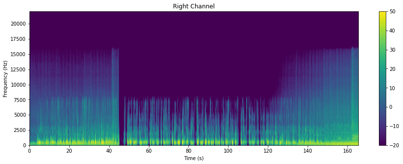

# ML/Data Science article 4

## Delivering Success in Natural Language Processing Projects: Part Two

**Publisher**: [*Medium*](https://medium.com/@ceethinwa/delivering-success-in-natural-language-processing-projects-part-four-405e8d5a407a)  
**Publishing Date**: *Sep 12, 2022*

*This is the fourth post of a five-part series where I aim to demystify Natural Language Processing (NLP) through a key learning tool that I would call the **NLP toolbox**. You can access the first article [here](https://medium.com/@ceethinwa/delivering-success-in-natural-language-processing-projects-part-one-40c4775cf6a9).*

What a ride! We got to explore both types of NLP data and visualize them in the previous section. Before we move any further, based on the last three parts, it’s clear to see that:

1. **Problem Identification** is a *process* of recognizing *valuable* problems that are *hard* for most people but *easy* to solve when *technology* and *creativity* are combined.
2. **Data Exploration** is a *process* of *analyzing* the data to find *patterns* within it and *summarize* key characteristics of the data.

----

### Feature Engineering

> So, what is Feature Engineering?

**Feature Engineering** is a *process* of *transforming* the data to make it *easier* for the computer to "understand" and produce *relevant* results during modelling.

It consists of various elements as shown:

  
*Feature Engineering visualized.*

Feature Engineering in NLP, as you can imagine, tends to be very difficult to understand and apply because

* data cleaning,
* domain knowledge,
* data pipelining,
* data validation and
* data relevance

are also broad. Furthermore, it is a repeated process because both

1. Concept drift — when the project goals change for the particular NLP project, and
2. Data drift — when the distribution of categories in NLP data changes

happen.

[Learn more about concept and data drift [here](https://medium.com/mlearning-ai/concept-drift-data-drift-and-machine-learning-monitoring-how-to-keep-your-model-accurate-66f3c91c7888).]

Due to the fact that feature engineering is cyclical, it should ideally be in the form of a data pipeline of some sort that is monitored, with model outputs identifying areas of improvement for the pipeline over time.

Depending on your NLP task and data type, feature engineering greatly varies.

----

#### **Data Cleaning**

##### **Data Cleaning for Audio**

As highlighted earlier, feature engineering audio typically tends to involve the data encoded in the form of spectrograms, ready for modelling.

Remember the visualizations below?

  

These were spectrograms of [this audio](https://ceethinwa.github.io/resources/aud/Abstract.mp3). Based on the visualization, we get an important insight: The sound was mixed to be identical for both left and right channels. Assuming there are a couple of audio files, spectrograms for only the left channel could be selected for modelling and feature engineering would be complete.

> However, using only spectrograms would create hidden features, making resulting models **uninterpretable** and **unexplainable**.

An alternative to spectrograms is to transcribe the audio, converting it to text data. Each audio would be represented as text transcripts as well, split by particular timestamps. At the moment, transcripts in English can be easily generated, with humans speaking the language reviewing the file to ensure accuracy and meaning are kept. However, for many low-resource languages, accessing audio — let alone transcribed audio — is difficult.

It is recommended to have more than one form of encoded audio data e.g. representing the same data as both a metadata table and spectrogram, which can each have an ID label linking the two.

[*Librosa*](https://pypi.org/project/librosa/) is a popular Python package used to identify spectral and rhythm features from any audio represented.

##### **Data Cleaning for Text**

Cleaning text data involves encoding it and removing unnecessary symbols — exactly what was done during data exploration. Text data can be encoded in two ways:

* Manually and
* Programmatically.

If encoded manually, it can be encoded in such a way that key words or phrases are kept i.e. one-hot encoding. Findings from data exploration and available domain knowledge would inform feature selection. This would typical result in direct feature extraction (if original dataset was text) or a metadata table (if original dataset was audio).

A benefit of manual encoding is that it gives human oversight to model input and it facilitates interpretability. However, the data annotation process can be quite tedious, and it tends to be poorly-paid work, relative to other aspects of feature engineering, such as feature selection and pipeline building.

Programmatic encoding can be very helpful in identifying hidden features that a human being may not have typically thought of, and it involves use of unsupervised machine learning models. However, we run into the same problem of model interpretability.

Programmatic encoding models include:

* *TF-IDF* (Term frequency-inverse document frequency) model — learn more about it [here](https://www.geeksforgeeks.org/tf-idf-model-for-page-ranking/)
* *PV-DM* (Distributed Memory Model of Paragraph Vectors) model — learn more about it [here](https://cs.stanford.edu/~quocle/paragraph_vector.pdf); it is implemented in a Python package, [Gensim](https://pypi.org/project/gensim/)
* *PV-DBOW* (Distributed Bag of Words model of Paragraph Vectors) model — learn more about it in the same article describing PV-DM; it is also implemented in Gensim
* *LDA* (Latent Dirichlet Allocation) model — learn more about it [here](https://www.geeksforgeeks.org/latent-dirichlet-allocation/); it is implemented in a Python package, [pyLDAvis](https://pypi.org/project/pyLDAvis/)
* Use of *Transformers* (pre-trained and validated deep learning models) such as BERT; learn more about transformers in general [here](https://medium.com/inside-machine-learning/what-is-a-transformer-d07dd1fbec04)

Further data examining similarity between specific vectors can be used to evaluate the effectiveness of this type of unsupervised encoding as shown [here](https://medium.com/analytics-vidhya/best-nlp-algorithms-to-get-document-similarity-a5559244b23b) and [here](https://gab41.lab41.org/doc2vec-to-assess-semantic-similarity-in-source-code-667acb3e62d7).

