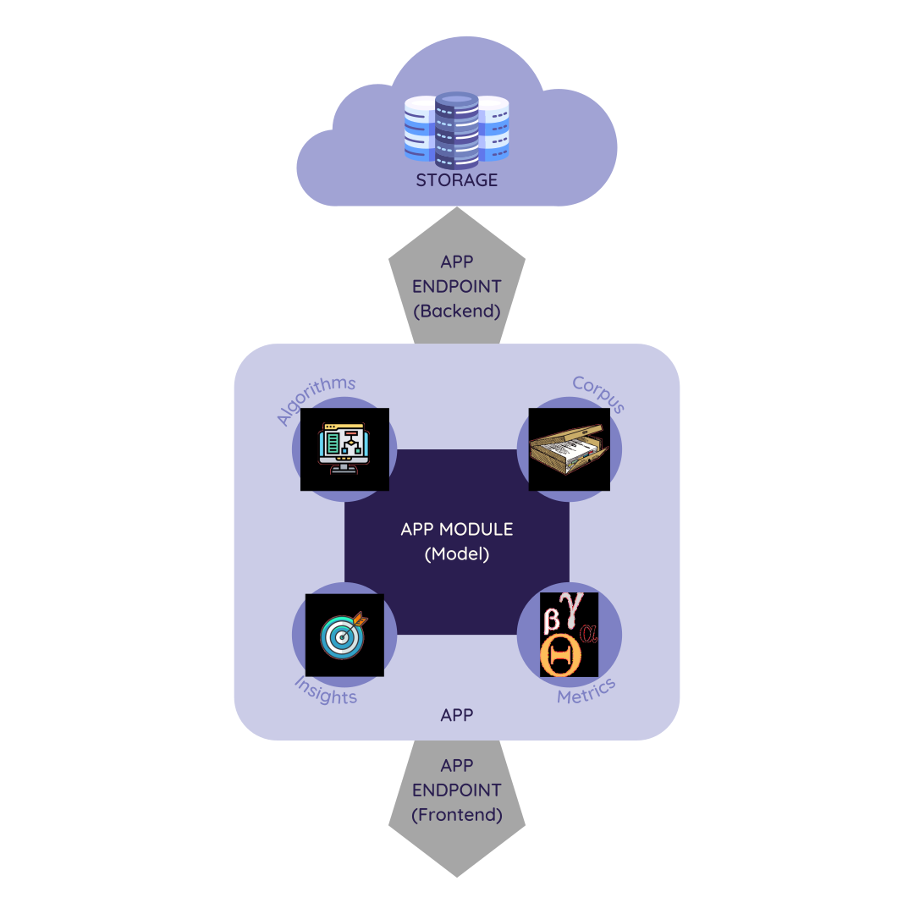
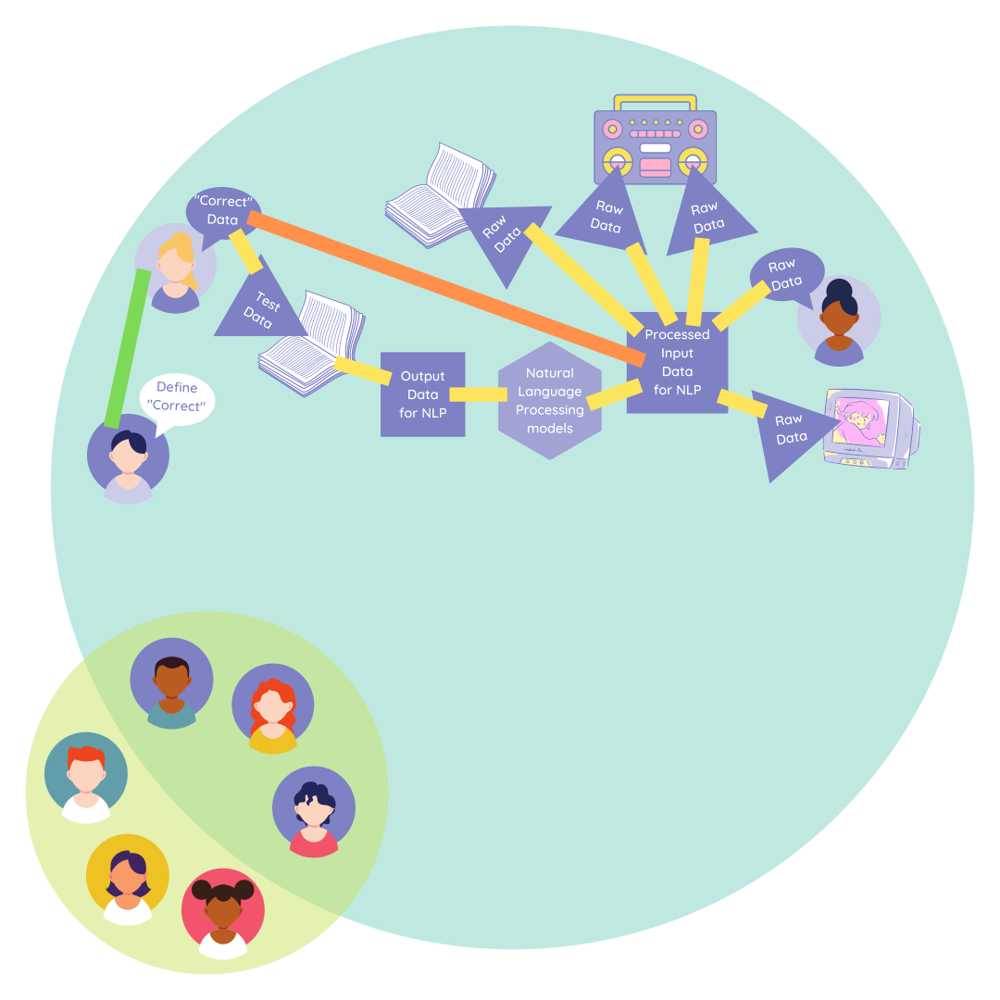

# ML/Data Science article 6

## Delivering Success in Natural Language Processing Projects: Part Five

**Publisher**: [*Medium*](https://medium.com/@ceethinwa/delivering-success-in-natural-language-processing-projects-part-five-55e9da952323)  
**Publishing Date**: *Oct 20, 2022*

*This is the final post of a five-part series where I aim to demystify Natural Language Processing (NLP) through a key learning tool that I would call **the NLP toolbox**. You can access the previous article [here](https://medium.com/@ceethinwa/delivering-success-in-natural-language-processing-projects-part-four-405e8d5a407a).*

Up till now, we have covered 3 key sections of the NLP toolbox:

* Tools for the problem
* Tools for the data
* Tools for the features

Now, let’s look at the final section: **Tools for the model**.

----

### Modelling

Simply put, **modelling** is a *process* of *training* the computer to look for *patterns* in data and *testing* how well the model *predicted* patterns in new data and *solved* the real-world problem.

From this, we see 4 qualities of a good model:

1. The model repeatedly runs because *modelling* is a cycle
2. The model is well-trained on diverse, objective-oriented data because *modelling involves training*
3. The model is great at spotting patterns and handling a variety of edge cases because *modelling involves vigorously tested pattern-spotting ability*
4. The model actually solves the problem in the real world (performing better than random chance) because *modelling is a solution*

With this perspective in mind, the model actually can be visualized as follows:
  
*What the model actually requires to be a success.*

This results in

1. The person for whom the model is built for — the target user — only cares about their **questions being answered with relevant answers** in the real world (the front of the app)
2. The team that maintains the model only focuses on the **quality of the modelling data** (through data validation and data relevance checks) and **tracking errors and interpreting results as the product is in use**
3. The team that maintains the IT infrastructure focuses on **secure and timely delivery of the data to the modelling team** and **secure and timely delivery of modelling results to the end user**

With that big picture in mind, the model becomes just as much about about the process and people as the actual model itself, like so:

With this perspective in mind, the model actually can be visualized as follows:
  
*The NLP system accounting for all stakeholders.*

